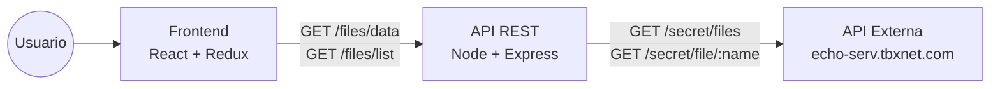
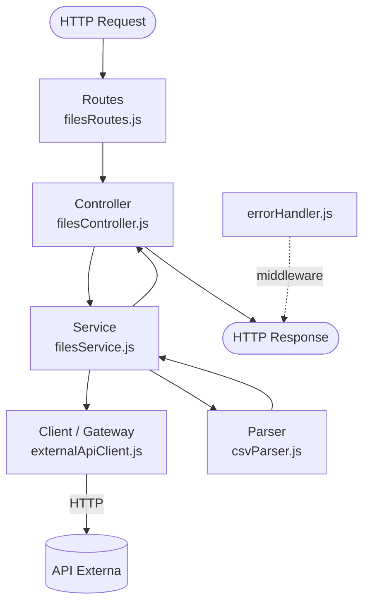
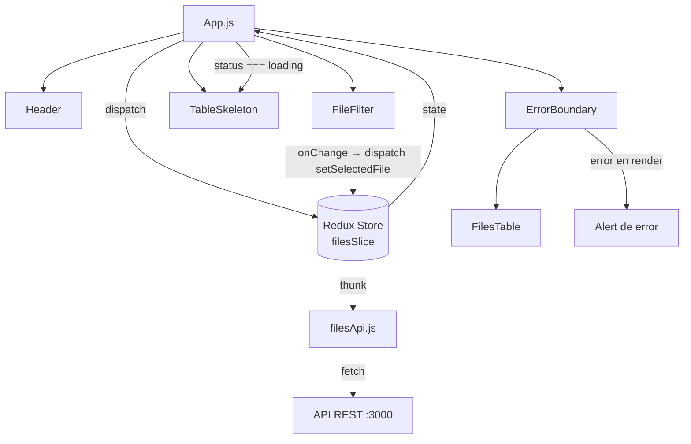
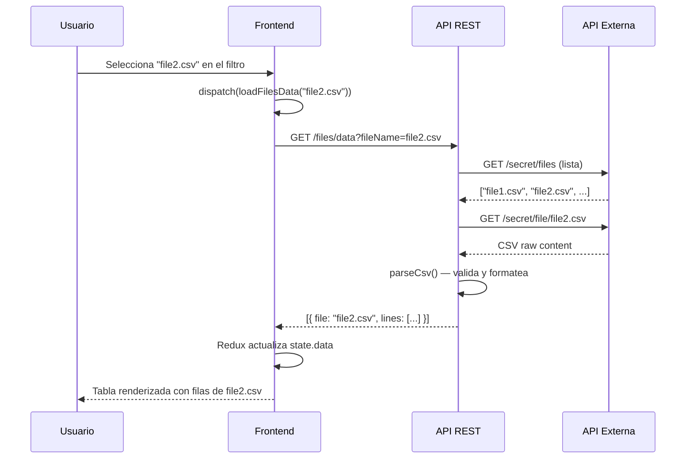
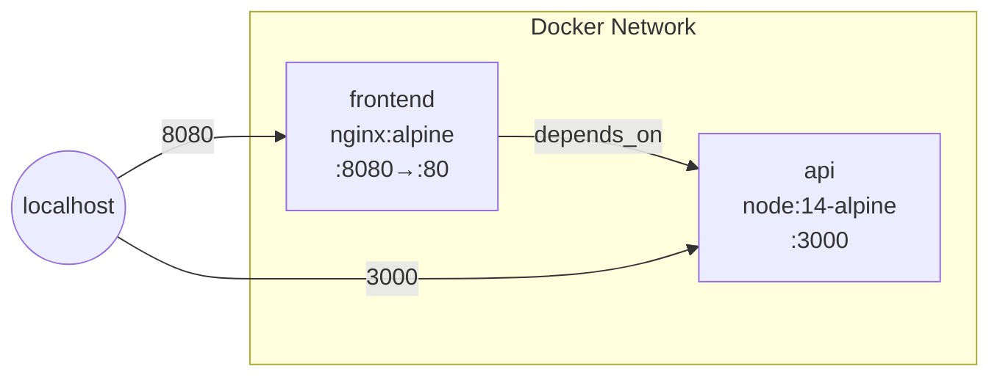

# Arquitectura — tbx-srp

## Visión general

Sistema full-stack compuesto por una **API REST** (Node.js + Express) y un **cliente React**.
La API actúa como intermediaria: consume un servicio externo, descarga y valida archivos CSV,
y expone los datos formateados. El frontend los consume y los muestra en una tabla filtrable.



---

## Estructura de directorios

```
tbx-srp/
├── api/                        # Backend Node.js + Express
│   ├── src/
│   │   ├── server.js           # Entry point — arranca el servidor HTTP
│   │   ├── app.js              # Factory de la app Express (sin puerto)
│   │   ├── config/
│   │   │   └── index.js        # Variables de entorno centralizadas
│   │   ├── routes/
│   │   │   └── filesRoutes.js  # Definición de rutas /files
│   │   ├── controllers/
│   │   │   └── filesController.js  # Manejo de req/res, delegación al service
│   │   ├── services/
│   │   │   └── filesService.js     # Lógica de negocio, orquesta client + parser
│   │   ├── clients/
│   │   │   └── externalApiClient.js  # Gateway al API externo (única fuente de verdad)
│   │   ├── parsers/
│   │   │   └── csvParser.js    # Lógica pura de validación y formateo CSV
│   │   ├── middlewares/
│   │   │   └── errorHandler.js # Manejo centralizado de errores Express
│   │   ├── utils/
│   │   │   └── logger.js       # Logger mínimo, silenciado en tests
│   │   └── docs/
│   │       └── openapi.js      # Especificación OpenAPI 3.0 + Swagger UI
│   └── test/
│       ├── setup.js            # NODE_ENV=test antes de cada suite
│       ├── csvParser.test.js
│       ├── filesService.test.js
│       ├── externalApiClient.test.js
│       ├── filesApi.test.js    # Tests e2e con supertest + nock
│       └── docs.test.js
│
├── frontend/                   # Cliente React
│   └── src/
│       ├── index.js            # Entry point React + Redux Provider
│       ├── App.js              # Componente raíz, manejo de estado global
│       ├── api/
│       │   └── filesApi.js     # Fetch wrapper hacia la API REST
│       ├── store/
│       │   ├── index.js        # Configuración del store Redux
│       │   └── filesSlice.js   # Slice: estado + reducers + thunks
│       └── components/
│           ├── Header.js
│           ├── FileFilter.js    # Select para filtrar por archivo
│           ├── FilesTable.js    # Tabla de resultados
│           ├── TableSkeleton.js # Placeholder animado mientras cargan los datos
│           └── ErrorBoundary.js # Captura errores de render y muestra fallback UI
│
├── docker-compose.yml
├── README.md
└── docs/
    ├── guide.md
    └── ARCHITECTURE.md
```

---

## Arquitectura de la API

### Capas y responsabilidades



| Capa | Archivo | Responsabilidad única |
|------|---------|----------------------|
| **Routes** | `filesRoutes.js` | Mapea paths a handlers del controller |
| **Controller** | `filesController.js` | Recibe req, llama al service, responde con `res.json()` o delega a `next(err)` |
| **Service** | `filesService.js` | Orquesta: lista archivos → descarga en paralelo → parsea → filtra inválidos |
| **Client** | `externalApiClient.js` | Único módulo que conoce la URL y API key del externo |
| **Parser** | `csvParser.js` | Lógica pura sin imports HTTP/Express, valida y formatea filas CSV |

### Patrones aplicados

**Dependency Injection via factories**

Cada capa recibe sus dependencias por parámetro, con un default en producción.
Esto permite inyectar mocks en tests sin librerías de patching.

```js
// En producción: usa el client real
function createFilesService(client = defaultClient) { ... }

// En tests: inyectás un stub
const service = createFilesService({ listFiles: mockFn, downloadFile: mockFn })
```

**Gateway pattern**

`externalApiClient.js` es el único punto de contacto con el servicio externo.
Ninguna otra capa conoce la URL base ni el header de autenticación.

**Resilience con `Promise.allSettled`**

Las descargas de archivos corren en paralelo. Si un archivo falla, los demás
siguen procesándose — el error se loggea y ese archivo se omite de la respuesta.

```js
const results = await Promise.allSettled(
  targetFiles.map(async (file) => parseCsv(await client.downloadFile(file), file))
)
// Solo se incluyen los fulfilled con líneas válidas
```

**Seguridad — path traversal prevention**

El client valida el nombre de archivo antes de construir la URL:

```js
const SAFE_FILE_NAME = /^[\w.-]+$/
// Rechaza: "../secret", "a/b.csv", ""
```

---

## Arquitectura del Frontend



### Flujo de datos

1. **Al montar `App`** → dispatcha `loadFilesList()` para popular el select de filtro
2. **Al montar o cambiar filtro** → dispatcha `loadFilesData(selectedFile)` para obtener los datos
3. **Redux** gestiona los estados: `idle → loading → succeeded | failed`
4. **`FilesTable`** recibe `data[]` y aplana las líneas de todos los archivos en filas de tabla

### Estado Redux (`filesSlice`)

```
{
  data: [],           // Array de { file, lines[] } — resultado de /files/data
  list: [],           // Array de strings — resultado de /files/list
  selectedFile: '',   // Valor del filtro activo (vacío = todos)
  status: 'idle',     // 'idle' | 'loading' | 'succeeded' | 'failed'
  error: null         // Mensaje de error si el fetch falla
}
```

---

## Flujo completo de una request



---

## Infraestructura

### Docker Compose



| Servicio | Imagen base | Build |
|----------|-------------|-------|
| `api` | `node:14-alpine` | Copia `src/`, instala solo deps de producción |
| `frontend` | `node:16-alpine` → `nginx:alpine` | Multi-stage: build con webpack, sirve con nginx |

### CI — GitHub Actions

Dos jobs independientes que corren en paralelo:

```
push/PR
├── job: api
│   ├── node 14
│   ├── npm install
│   ├── npm run lint   (StandardJS)
│   └── npm test       (Mocha)
│
└── job: frontend
    ├── node 16
    ├── npm install
    ├── npm test       (Jest)
    └── npm run build  (webpack)
```

---

## Decisiones de diseño

| Decisión | Alternativa descartada | Motivo |
|----------|----------------------|--------|
| CommonJS en API | ESModules | Node 14 soporta ESM pero requiere config extra; CommonJS es más simple para el constraint de versión |
| StandardJS (sin config) | ESLint con config custom | Cero fricción: sin `.eslintrc`, reglas fijas y conocidas |
| Mocha + Chai en API | Jest | Más idiomático en proyectos Node puro; Chai tiene un DSL de assertions más expresivo para APIs |
| Jest + RTL en Frontend | Cypress | Tests unitarios de componentes sin levantar browser; más rápido en CI |
| Redux Toolkit | useState + Context | Estado asincrónico con múltiples fuentes (lista + datos) se maneja limpio con `createAsyncThunk` |
| `Promise.allSettled` | `Promise.all` | `Promise.all` falla todo si uno falla; `allSettled` permite respuesta parcial |
| Webpack manual | Vite / CRA | El constraint de Node 16 es compatible con ambos, pero Webpack da más control explícito |
| `ErrorBoundary` como class component | try/catch en render | React solo soporta error boundaries via `getDerivedStateFromError` en class components; no hay equivalente funcional nativo |
